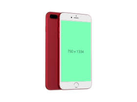

# mj-mockup-generator

Simple & easy to use mockup generator from MockupsJar

[](https://packagephobia.now.sh/result?p=mj-mockup-generator)
[](https://snyk.io/test/github/mockupsjar/mj-mockup-generator?targetFile=package.json)

## Install

```
$ npm install mj-mockup-generator
```

## Usage

```js
const mockupGenerator = require('mj-mockup-generator');
const generator = new mockupGenerator({host: process.env.API_URL, key: process.env.API_TOKEN});

const data = {
    zoomLevel: 0.5,
    format: "jpg",
    input: ['https://dummyimage.com/750x1334/7dffb8/000000']
};

let response = await generator.render('iphone7-red', data);
console.log('response', response);
// {
//     status: 'success',
//         data: {
//     slug: 'iphone7-red',
//         name: 'iPhone7 RED',
//         status: 'successful',
//         zoomLevel: 0.5,
//         format: 'jpg',
//         result: {
//              url: 'https:/path.../renders/mockup-z0yIcUtWFZjFyeNU.jpg',
//              previewUrl: 'https://path.../renders/PcOniA1ANn6HLnX7-RFgaz9u5IiH7Ryud.jpg'
//     }
// }
```

